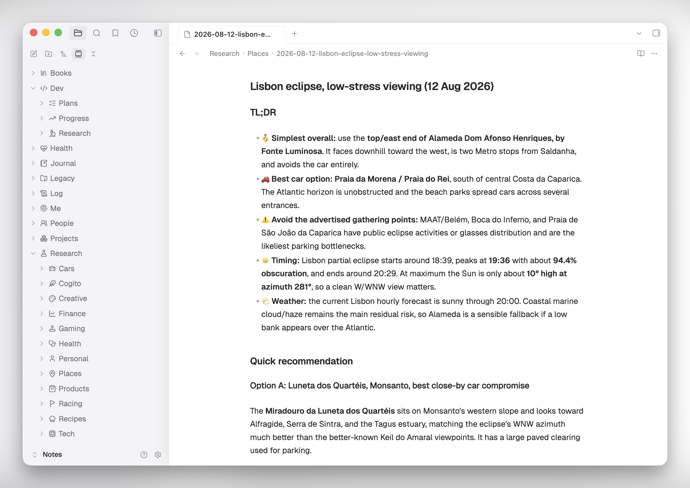

# Minimal Fab

A polished Obsidian theme built on [Minimal](https://github.com/kepano/obsidian-minimal) by Steph Ango, then refined into a calmer, more deliberate desktop experience inspired by the [Codex macOS app](https://openai.com/codex/).

The name combines its Minimal foundation with **Fab**, Fabrizio's personal design layer.



Minimal Fab keeps the compatibility and restraint of the original Minimal theme while giving the surrounding app more character: quieter chrome, cleaner hierarchy, subtle translucency, finer borders, compact controls, calmer titles, and more considered light and dark palettes.

Minimal Fab is a third-party community theme and is not affiliated with Obsidian or OpenAI.

## Highlights

- Refined light and dark palettes with a darker, more focused writing surface in dark mode
- Translucent macOS sidebars inspired by Codex, with restrained dividers and shadows
- Geist-first typography with native system fallbacks
- Smaller, quieter note titles, tabs, breadcrumbs, toolbars, and status details
- Polished command palette, quick switcher, backlinks, file tree, and empty-tab states
- A small, readable override layer that can follow future Minimal releases

## Install

### From the Obsidian theme directory

Once Minimal Fab is listed, open **Settings → Appearance → Themes → Manage**, search for **Minimal Fab**, and select **Install and use**.

### Manually from a GitHub release

1. Download `manifest.json` and `theme.css` from the [latest GitHub release](https://github.com/linuz90/fab-obsidian-theme/releases/latest).
2. Create `<your-vault>/.obsidian/themes/Minimal Fab/`.
3. Put both files inside that folder.
4. Restart Obsidian, then select **Minimal Fab** in **Settings → Appearance → Themes**.

The folder name must exactly match the `name` in `manifest.json`.

### Development install

Clone the repository and link the two files Obsidian loads:

```bash
git clone https://github.com/linuz90/fab-obsidian-theme.git ~/Code/fab-obsidian-theme
mkdir -p "/path/to/vault/.obsidian/themes/Minimal Fab"
ln -s ~/Code/fab-obsidian-theme/manifest.json "/path/to/vault/.obsidian/themes/Minimal Fab/manifest.json"
ln -s ~/Code/fab-obsidian-theme/theme.css "/path/to/vault/.obsidian/themes/Minimal Fab/theme.css"
```

Run `scripts/build-theme`, then reload Obsidian with `Cmd+R`. Changes to `manifest.json` require a full restart.

## Optional sidebar icons

The folder icons shown in the screenshot come from the optional [Iconize](https://github.com/FlorianWoelki/obsidian-iconize) community plugin. Minimal Fab does not require or bundle Iconize; it simply gives monochrome sidebar icons spacing and contrast that fit the theme.

After installing Iconize, right-click any file or folder and select **Change icon**. The built-in Lucide pack is enough to create a restrained, consistent sidebar without downloading extra assets.

### Let an agent assign the icons

Iconize stores its configuration in `<your-vault>/.obsidian/plugins/obsidian-icon-folder/`, with path-to-icon mappings in `data.json`. You can point a coding agent at that folder and ask it to choose the icons for you.

A safe prompt:

> Inspect `<your-vault>/.obsidian/plugins/obsidian-icon-folder/`, especially `manifest.json` and `data.json`. Back up `data.json`, preserve its `settings` and all existing mappings, then add restrained Lucide icons for folders that do not have one. Use vault-relative path keys and the plugin's existing `Li...` icon identifiers. Do not edit the plugin code. Show me the proposed mapping before writing, and tell me when to reload Obsidian.

Close Obsidian before a direct `data.json` edit, or reload it immediately afterward, so the running plugin does not overwrite the agent's changes. Iconize is optional and its upstream project currently describes itself as end-of-maintenance; Minimal Fab remains fully usable without it.

## Typography

Minimal Fab prefers [Geist](https://vercel.com/font) and Geist Mono when they are installed, then falls back to the native system fonts. The theme never downloads fonts or other assets at runtime.

## Development

The distributable `theme.css` is generated from a pinned Minimal base plus Minimal Fab's focused override layer:

```text
upstream/minimal.css + src/fab.css → theme.css
```

- Edit `src/fab.css`, never `upstream/minimal.css`.
- Run `scripts/build-theme` after CSS changes.
- Run `scripts/update-minimal [tag-or-branch]` to refresh Minimal, review the upstream diff, and rebuild.
- Minimal's version and Minimal Fab's version are independent; publishing a Minimal Fab update requires an intentional `manifest.json` version bump.

See [UPSTREAM.md](./UPSTREAM.md) for the pinned Minimal revision and [PUBLISHING.md](./PUBLISHING.md) for the release and Community Directory checklist.

## License and attribution

Minimal Fab's original work is released under the [MIT License](./LICENSE).

The repository includes a pinned copy of [Minimal](https://github.com/kepano/obsidian-minimal), also MIT-licensed. Steph Ango retains copyright in Minimal; its license is preserved in [LICENSE-Minimal](./LICENSE-Minimal).

If you enjoy the foundation Minimal Fab builds on, consider [supporting Steph's work](https://www.buymeacoffee.com/kepano).
