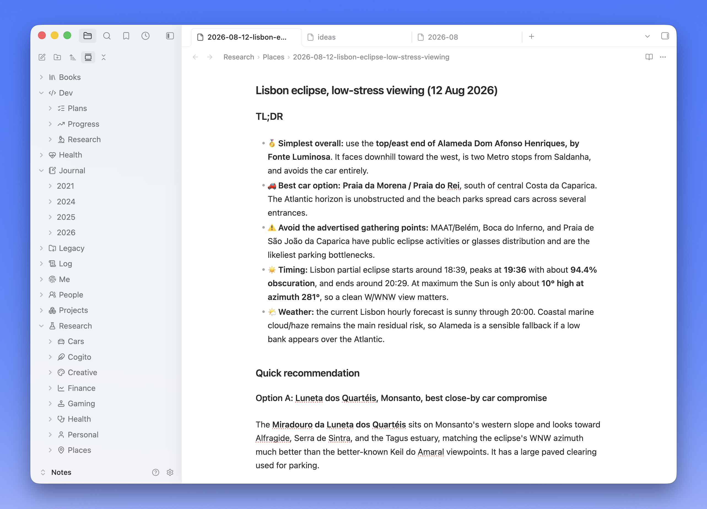

# mnml

A quiet, native-feeling Obsidian theme by [Fabrizio Rinaldi](https://x.com/linuz90), built on [Minimal](https://github.com/kepano/obsidian-minimal) by Steph Ango (`@kepano`) and inspired by the [Codex app](https://openai.com/codex/).



Minimal provides the design and compatibility foundation. mnml refines the app as a whole with **a cleaner palette, subtler iconography, quieter details, and a more native macOS feel.** Its generated distribution also passes Obsidian's official CSS scanner with no blocking errors while keeping the pinned upstream source intact.

This is a third-party community theme and is not affiliated with Obsidian or OpenAI.

## Install

### From the Obsidian theme directory

Once mnml is listed, open **Settings → Appearance → Themes → Manage**, search for **mnml**, and select **Install and use**.

### Manually from a GitHub release

1. Download `manifest.json` and `theme.css` from the [latest GitHub release](https://github.com/linuz90/obsidian-mnml/releases/latest).
2. Create `<your-vault>/.obsidian/themes/mnml/`.
3. Put both files inside that folder.
4. Restart Obsidian, then select **mnml** in **Settings → Appearance → Themes**.

The folder name must exactly match the `name` in `manifest.json`.

mnml requires Obsidian 1.13.0 or newer. On desktop, use installer version 1.2.7 or newer because the theme uses `color-mix()`.

For the closest match to the screenshots on macOS, enable **Translucent window** under **Settings → Appearance → Advanced**. mnml works normally without translucency.

### Development install

Clone the repository and link the two files Obsidian loads:

```bash
git clone https://github.com/linuz90/obsidian-mnml.git ~/Code/obsidian-mnml
mkdir -p "/path/to/vault/.obsidian/themes/mnml"
ln -s ~/Code/obsidian-mnml/manifest.json "/path/to/vault/.obsidian/themes/mnml/manifest.json"
ln -s ~/Code/obsidian-mnml/theme.css "/path/to/vault/.obsidian/themes/mnml/theme.css"
```

Run `pnpm install` once, then `pnpm build` and reload Obsidian with `Cmd+R`. Changes to `manifest.json` require a full restart.

## Optional sidebar icons

The folder icons shown in the screenshot come from the optional [Iconize](https://github.com/FlorianWoelki/obsidian-iconize) community plugin. mnml does not require or bundle Iconize; it simply gives monochrome sidebar icons spacing and contrast that fit the theme.

After installing Iconize, right-click any file or folder and select **Change icon**. The built-in Lucide pack is enough to create a restrained, consistent sidebar without downloading extra assets.

### Let an agent assign the icons

Iconize stores its configuration in `<your-vault>/.obsidian/plugins/obsidian-icon-folder/`, with path-to-icon mappings in `data.json`. You can point a coding agent at that folder and ask it to choose the icons for you.

A safe prompt:

> Inspect `<your-vault>/.obsidian/plugins/obsidian-icon-folder/`, especially `manifest.json` and `data.json`. Back up `data.json`, preserve its `settings` and all existing mappings, then add restrained Lucide icons for folders that do not have one. Use vault-relative path keys and the plugin's existing `Li...` icon identifiers. Do not edit the plugin code. Show me the proposed mapping before writing, and tell me when to reload Obsidian.

Close Obsidian before a direct `data.json` edit, or reload it immediately afterward, so the running plugin does not overwrite the agent's changes. Iconize is optional and its upstream project currently describes itself as end-of-maintenance; mnml remains fully usable without it.

## Typography

mnml uses Obsidian's native system font stacks for interface, text, editor, and monospace typography. The theme never downloads fonts or other assets at runtime.

## Development

The distributable `theme.css` is generated from a pinned Minimal base plus mnml's focused override layer, then normalized for Obsidian's official CSS scanner:

```text
upstream/minimal.css + src/mnml.css → standards-normalized theme.css
```

- Edit `src/mnml.css`, never `upstream/minimal.css`.
- Run `pnpm build` after CSS changes and `pnpm check` before committing.
- Run `scripts/update-minimal [tag-or-branch]` to refresh Minimal, review the upstream diff, and rebuild.
- Minimal's version and mnml's version are independent; publishing a mnml update requires an intentional `manifest.json` version bump.

See [UPSTREAM.md](./UPSTREAM.md) for the pinned Minimal revision and [PUBLISHING.md](./PUBLISHING.md) for the release and Community Directory checklist.

## License and attribution

mnml's original work is released under the [MIT License](./LICENSE).

The repository includes a pinned copy of [Minimal](https://github.com/kepano/obsidian-minimal), also MIT-licensed. Steph Ango retains copyright in Minimal; its license is preserved in [LICENSE-Minimal](./LICENSE-Minimal).

If you enjoy the foundation mnml builds on, consider [supporting Steph's work](https://www.buymeacoffee.com/kepano).
